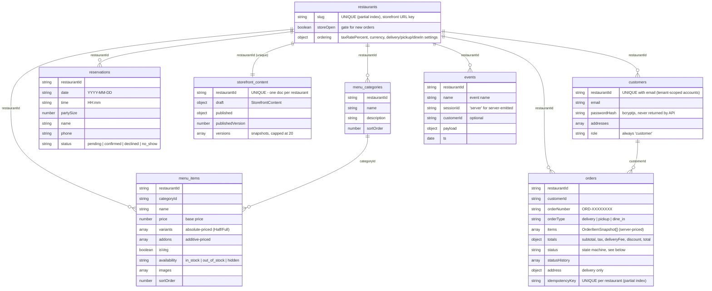

# RestroPulse Architecture

## System Overview

RestroPulse is a social media management platform for restaurants, organized as a **Turborepo monorepo** with npm workspaces. It automates content creation, scheduling, and publishing to Instagram and Facebook via the Meta Graph API.

## Monorepo Structure

```
restropulse/
  apps/
    web/          @restropulse/web          React SPA (Vite) -- merchant dashboard (social SaaS + ordering admin)
    storefront/   @restropulse/storefront   React SPA (Vite) -- public customer ordering site (/:slug)
    api/          @restropulse/api          Express REST API
    publisher/    @restropulse/publisher    Cron worker -- publishing + token refresh
    content-engine/ @restropulse/content-engine  Worker -- content generation
    db-cli/       @restropulse/db-cli       CLI for DB seed/migration
  packages/
    shared/       @restropulse/shared       Unified TypeScript types
    db/           @restropulse/db           Shared MongoDB connection + helpers
    publishing/   @restropulse/publishing   Meta API, encryption, publishing/token-refresh crons
    tsconfig/     @restropulse/tsconfig     Shared tsconfig presets
    eslint-config/ @restropulse/eslint-config Shared ESLint flat config
  tools/
    image-studio/ (not a workspace)         Next.js 14 Replicate image generator (own lockfile)
```

## Application Architecture Diagram

```
                              +-------------------+
                              |   Firebase Auth   |
                              |  (Phone OTP Auth) |
                              +--------+----------+
                                       |
                            ID Token   | Verify
                                       v
+--------------------+  REST API  +--------------------+
|   Frontend (Web)   |---------->|   Backend (API)     |
|   React + Vite     |<----------|   Express           |
|   Port 3000        |  JSON     |   Port 3001         |
+--------------------+           +---+-----+-------+---+
                                     |     |       |
                         Reads/Writes|     |       | Reads/Writes
                                     v     |       v
                              +------+-----+--+ +--+-------------+
                              |   MongoDB     | | Meta Graph API |
                              |   Atlas       | | v18.0          |
                              |   restropulse | | (Instagram/FB) |
                              +---+-----+-----+ +----------------+
                                  |     |
                   Reads/Writes   |     |  Reads/Writes
                    +-------------+     +-------------+
                    |                                  |
          +---------v----------+          +------------v---------+
          | Publisher Worker   |          | Content Engine Worker |
          | Cron: Publish posts|          | Cron: Generate content|
          | Cron: Refresh tokens|         | Process strategy cycles|
          +--------------------+          +------------------------+
```

## Applications

### apps/web -- Frontend SPA

- **Framework**: React 19 + TypeScript + Vite 6
- **Styling**: Tailwind CSS (CDN)
- **Auth**: Firebase Authentication (phone OTP)
- **Port**: 3000

**Pages** (state-based routing via `ViewState`):

| View         | Component          | Purpose                         |
|--------------|--------------------|---------------------------------|
| LOGIN        | Login.tsx          | Phone OTP authentication        |
| ONBOARDING   | Onboarding.tsx     | New user registration (multi-step) |
| DASHBOARD    | Dashboard.tsx      | Restaurant overview              |
| STUDIO       | ContentStudio.tsx  | Content calendar, post management|
| INPUTS       | Inputs.tsx         | Offers, chef specials, menu      |
| STRATEGY     | Strategy.tsx       | Content strategy configuration   |

**Overlay components** (not ViewState-routed):

| Component          | Purpose                                              |
|--------------------|------------------------------------------------------|
| ProfileSheet.tsx   | Account settings bottom sheet (subscription, billing, Instagram, profile, logout) |
| AdhocPostModal.tsx | Create new post modal (triggered from header or empty state) |

**Auth Flow**:
1. User enters phone number; Firebase sends OTP via RecaptchaVerifier
2. User submits OTP; Firebase confirms; frontend obtains Firebase ID token
3. Frontend sends ID token to `POST /api/auth/firebase`
4. Backend verifies via Firebase Admin SDK, returns JWT pair
5. Frontend stores `rp_token` (15min) and `rp_refresh_token` (7d) in localStorage
6. If user has no `restaurantId`, frontend routes to ONBOARDING view

**Onboarding Flow** (new users only):
1. User completes 4-step form: user details, restaurant details, location (Google Maps), account manager selection
2. Frontend sends `POST /api/restaurant` with collected data
3. Backend creates restaurant, links to user, issues fresh JWT tokens with new restaurantId
4. Frontend stores new tokens and navigates to DASHBOARD

**React Effect Patterns** (follow these for all new async `useEffect` code):

*Pattern A — One-shot non-idempotent effect (single-use token consumption):*
Email verification and Instagram OAuth processing consume single-use tokens. These must
not be triggered on page load — email security scanners auto-follow links and would
consume the token before the human clicks. Use a confirmation button; only consume
on user interaction. Guard with a module-level variable (not `useRef`) so the guard
survives React StrictMode's unmount/remount cycle in development.
```ts
let operationAttempted = false;  // module-level, outside component

const handleConfirm = () => {
    if (operationAttempted) return;
    operationAttempted = true;
    // call API that consumes a single-use token
};
```

*Pattern B — Async data fetch with stale-request guard:*
```ts
useEffect(() => {
    let isActive = true;
    fetchData().then(result => {
        if (!isActive) return;
        setState(result);
    });
    return () => { isActive = false; };
}, [dep]);
```

*Pattern C — Event listeners and timers:* Always return a cleanup function. This is
already done correctly throughout the codebase.

### apps/api -- REST API

- **Framework**: Express 4 + TypeScript
- **Database**: MongoDB (via `@restropulse/db`)
- **Auth**: Firebase Admin SDK + JWT (access/refresh tokens)
- **Port**: 3001

**Route Groups**:

| Prefix                           | Purpose                            |
|----------------------------------|------------------------------------|
| `/api/auth/*`                    | Authentication (Firebase, JWT)     |
| `POST /api/restaurant`           | Create restaurant (onboarding)     |
| `GET /api/restaurant/account-managers` | Account managers by city/zone |
| `/api/restaurant/:id`           | Restaurant CRUD, offers, specials  |
| `/api/posts/*`                   | Post CRUD, publishing, generation  |
| `/api/strategy/*`               | Content strategy and cycles        |
| `/api/integrations/instagram/*` | OAuth, account management, GDPR    |
| `/api/subscriptions/*`          | Plans, subscribe, cancel, webhooks, credits |
| `/api/coupons/*`                | Coupon CRUD, validation (admin)    |
| `/api/credit-packs/*`           | Credit pack CRUD (admin)           |
| `/api/invoices/*`               | Invoice listing, detail, PDF       |
| `/health`                        | Health check                       |

### apps/publisher -- Publishing Worker

- **Runtime**: Standalone Node.js process (no Express)
- **Cron Jobs**:
  - Publishing: `*/5 * * * *` (every 5 minutes) -- publishes due SCHEDULED posts
  - Token refresh: `0 2 * * *` (daily 2:00 AM IST) -- refreshes expiring Instagram tokens

### apps/content-engine -- Content Generation Worker

- **Runtime**: Standalone Node.js process (no Express)
- **Polling**: `*/2 * * * *` (every 2 minutes)
- **Jobs**:
  - Adhoc post processing: generates content for posts with status `PENDING_CONTENT`
  - Strategy cycle processing: generates posts for `APPROVED` cycles
  - Strategy generation: creates strategies for `PENDING_GENERATION` requests

### Content Engine AI backend

When `CONTENT_GENERATOR_BACKEND=ai`, the content-engine swaps the placeholder generator for `AIContentGenerator` -- a thin orchestrator over four pluggable seams. Default chain:

```text
IContentGenerator               (existing public contract)
  AIContentGenerator            (Vercel AI SDK orchestrator)
    ILLMProvider                  AnthropicLLMProvider (Sonnet for cycles, Haiku for posts)
    IMediaGenerator               PlaceholderMediaGenerator (default) | FalAIMediaGenerator (when MEDIA_BACKEND=fal-ai)
    ICurrentAffairsProvider       Noop | CalendarOnly (V1) | SonarAugmented(CalendarOnly) (V1+V2)
    IDomainSpecialization         RestaurantSpecialization
```

Each seam is a separately swappable interface. Adding a second domain (salon, fitness) is an `IDomainSpecialization` impl. Adding a new LLM provider is a one-import swap inside `AnthropicLLMProvider`. Adding a new media provider (Replicate, Runway) is an `IMediaGenerator` impl.

#### Async media flow (REEL/VIDEO with `MEDIA_BACKEND=fal-ai`)

```text
adhoc-processor finds PENDING_CONTENT post
  -> AIContentGenerator.generatePost
    -> caption (Anthropic, sync)
    -> media (FalAIMediaGenerator.generateVideo)
      -> queue submit -> mediaJobs row inserted (status=RUNNING)
      -> returns immediately
  -> processor writes post.status=PENDING_MEDIA + mediaJobId

media-job-poller (every 30s)
  -> finds PENDING_MEDIA posts
  -> per post: live-poll fal queue, transition COMPLETED -> applyMediaJobResultToPost (status=PENDING_APPROVAL)
                                            FAILED   -> markPostFailedWithMedia (status=MISSED_DEADLINE)
                                            stale > 10min -> reap as FAILED

post-resume scan (worker boot, when MEDIA_BACKEND=fal-ai)
  -> finds posts with PENDING_MEDIA + lastStepAt > 5min ago
  -> triggers one poll cycle each (idempotent, matches cron path)
```

#### Cost attribution

Every external API call writes one row to `costEvents` (MongoDB) AND emits a `customEvents` row to Application Insights (via `trackAIUsage`), tagged with `restaurantId`, `postId`, `cycleId`, `surface`, `step`, `model`. The two Azure Monitor Workbooks under `infra/workbooks/` consume the App Insights events.

For full rationale (decision drivers, framework selection, RAG strategy, retry profiles, durability semantics), see [ADR 0001 - Content-Engine AI Framework](adr/0001-content-engine-ai-framework.md).

## Secrets Management

All runtime secrets flow through `packages/secrets` (`@restropulse/secrets`).

```
ISecretsProvider
  EnvSecretsProvider            (default -- reads process.env)
  AzureKeyVaultSecretsProvider  (Azure Key Vault via DefaultAzureCredential)
    wrapped by CachedSecretsProvider (in-memory cache, avoids repeated KV API calls)
```

**Startup flow when `SECRETS_BACKEND=azure-kv`:**
1. `createSecretsProvider('azure-kv')` builds a cached KV provider
2. `hydrateEnvFromProvider(provider, APP_SECRET_KEYS)` fetches all keys in parallel, writes to `process.env`
3. `loadAndValidateEnv(...)` runs unchanged -- reads from `process.env` as always

**Per-service scoping:** `config/secrets-manifest.ts` is the single source of truth. Each secret declares `apps[]`. `getAppSecretKeys(app)` returns only that app's keys -- no service fetches a secret it does not own.

**Key Vault naming:** `MY_API_KEY` -> `my-api-key`. With `AZURE_KEY_VAULT_KEY_PREFIX=staging`: `staging-my-api-key`.

### apps/db-cli -- Database CLI

- **Framework**: Commander + chalk + ora
- **Purpose**: Seed data, run migrations, database operations

## Shared Packages

### packages/shared

Single source of truth for all TypeScript types, enums, and interfaces used across the monorepo. Key exports: `User`, `Restaurant`, `Post`, `ContentStrategy`, `StrategyCycle`, `AccountManager`, `SubscriptionPlan`, `Subscription`, `Coupon`, `Invoice`, `CreditPack`, and all status/type enums. Also exports constants: `POST_TYPE_CREDIT_COSTS`, `FREE_SIGNUP_CREDITS`.

### packages/db

Shared MongoDB connection layer with collection helpers:

| Module                  | Exports                                     |
|-------------------------|---------------------------------------------|
| connection.ts           | `connectDB()`, `disconnectDB()`, `getDB()`, `setDB()`, collection getters |
| posts.ts                | `findPostById()`, `findAllPosts()`, `createPost()`, `updatePost()` |
| restaurants.ts          | `findRestaurantById()`, `createRestaurant()`, `updateRestaurant()` |
| strategy.ts             | `getContentStrategiesCollection()`, `getStrategyCyclesCollection()` |
| users.ts                | `findUserByPhone()`, `findUserByFirebaseUid()` |
| account-managers.ts     | `getAccountManagersByCity()`, `getAccountManagersByCityAndZone()` |
| subscription-plans.ts   | `findCurrentPlans()`, `findPlanBySlug()`, `findPlanById()`, `createPlan()`, `versionPlan()` |
| subscriptions.ts        | `findActiveSubscription()`, `createSubscription()`, `updateSubscription()`, `deductCredits()`, `addCredits()` |
| coupons.ts              | `findCouponByCode()`, `createCoupon()`, `updateCoupon()`, `createCouponRedemption()` |
| credit-packs.ts         | `findActiveCreditPacks()`, `findCreditPackById()`, `createCreditPurchase()` |
| invoices.ts             | `createInvoice()`, `findInvoicesByRestaurant()`, `findInvoiceById()`, `updateInvoice()` |

`setDB()` enables test injection with `mongodb-memory-server`.

### packages/publishing

Shared publishing layer used by both `apps/api` and `apps/publisher`. Key exports:

| Module                | Exports                                                              |
|-----------------------|----------------------------------------------------------------------|
| encryption.ts         | `encrypt()`, `decrypt()`, `generateEncryptionKey()`                 |
| instagram-api.ts      | `generateOAuthUrl()`, `handleOAuthCallback()`, `refreshAccessToken()`, `validateToken()`, `getInstagramProfile()`, `isInstagramConfigured()`, `prepareCredentialsForStorage()`, `validateStateToken()` |
| publishing-service.ts | `publishPost()`                                                      |
| publishing-cron.ts    | `startPublishingCron()`, `triggerManualPublish()`, `getRecentPublishAttempts()`, `runPublishingJob()` |
| token-refresh-cron.ts | `startTokenRefreshCron()`, `triggerManualRefresh()`, `checkAndRefreshTokenIfNeeded()`, `getRecentRefreshAttempts()` |

## Data Flows

### Post Publishing Flow

```
1. User creates/approves post (API) --> status: SCHEDULED
2. Publisher cron runs every 5 min
3. Finds posts where scheduledFor <= now AND status = SCHEDULED
4. Atomically sets status = PUBLISHING
5. Decrypts Instagram token (AES-256-CBC)
6. Uploads media to Facebook CDN (image: /photos, video: direct URL)
7. Creates IG media container via Meta Graph API
8. For video: polls container status every 5s (max 5 min)
9. Publishes container via /media_publish
10. Updates post status: PUBLISHED or FAILED (max 3 attempts)
```

### Meta Graph API OAuth Flow

```
1. Frontend redirects to Facebook OAuth dialog
2. User authorizes RestroPulse app
3. Facebook redirects to /api/integrations/instagram/callback with code
4. Backend exchanges code for short-lived token
5. Exchanges short-lived for long-lived token (60 days)
6. Discovers Facebook Pages via /me/accounts
7. Finds IG Business Account per page
8. Stores encrypted page access token in restaurant document
9. Token refresh cron renews tokens 15 days before expiry
```

### Content Generation Flow

```
1. User requests content (API /posts/generate or approves strategy cycle)
2. Post/cycle stored with status PENDING_CONTENT or APPROVED
3. Content engine polls every 2 min
4. Finds pending work, generates content (placeholder; future: AI)
5. Updates post with caption, thumbnail, media URLs
6. Advances status to PENDING_APPROVAL
7. User reviews and approves --> status: SCHEDULED
```

### Subscription & Billing Flow

#### Subscription document lifecycle

Every restaurant has exactly **one** subscription document in MongoDB. The collection
enforces a unique index on `restaurantId`. The document is created during onboarding and
transitions through the following statuses:

```
Onboarding (POST /api/restaurant)
    |
    v
 NONE  <-- free tier, holds FREE_SIGNUP_CREDITS, no active plan
    |
    | POST /api/subscriptions/subscribe
    v
 CREATED  <-- Razorpay subscription created, awaiting payment
    |
    | webhook: subscription.authenticated
    v
 AUTHENTICATED  <-- payment method confirmed, first charge pending
    |
    | webhook: subscription.charged
    v
 ACTIVE  <-- recurring billing active
    |
    +---> PAST_DUE   <-- payment failed, retrying
    |
    +---> HALTED     <-- Razorpay halted after max retries
    |
    +---> CANCELLED  <-- user cancelled (at period end or immediately)
              |
              | POST /api/subscriptions/subscribe (re-subscribe)
              v
           CREATED  <-- same document updated, new Razorpay subscription ID
```

Because only one document exists per restaurant, the subscribe route **updates** the
existing document (via `updateSubscription`) rather than inserting a new one whenever
`findActiveSubscription` returns a record. A fresh `insertOne` is only used if no
document exists at all (which should not occur in normal operation after onboarding).

#### Razorpay customer lifecycle

A Razorpay customer record is created eagerly during onboarding and its ID stored as
`user.razorpayCustomerId`. Razorpay has no delete API; on account deletion the customer
PII is anonymized via `PATCH /v1/customers/:id` (name set to "Deleted User", email and
contact cleared). The record is retained by Razorpay for their compliance obligations.

If the onboarding customer-create call fails (network blip, Razorpay downtime), the
customer may exist in Razorpay but the ID is not stored in our DB. The subscribe route
detects this when creation returns "Customer already exists" and recovers the ID by
calling `GET /v1/customers?contact=:phone` then backfills `razorpayCustomerId`.

#### First-time subscribe (new user)

```
1. Onboarding creates subscription document: status=NONE, credits=FREE_SIGNUP_CREDITS
2. Onboarding creates Razorpay customer; stores ID in user.razorpayCustomerId
3. User selects plan + billing cycle on the frontend
4. POST /api/subscriptions/subscribe
   a. Validates plan slug and billing cycle
   b. Validates and resolves coupon (if provided)
   c. Checks for existing active subscription (ACTIVE/PAST_DUE/CREATED/AUTHENTICATED -> 409)
   d. Resolves or recovers Razorpay customer ID
   e. Creates Razorpay Subscription via POST /v1/subscriptions
   f. Updates the NONE document to status=CREATED with new razorpaySubscriptionId
5. Frontend opens Razorpay checkout with subscriptionId + keyId
6. User completes payment
7. Razorpay webhook: subscription.authenticated -> status=AUTHENTICATED
8. Razorpay webhook: subscription.charged -> status=ACTIVE, credits topped up, invoice created
```

#### Re-subscribe after cancellation or halt

```
1. Existing document has status=CANCELLED or HALTED
2. POST /api/subscriptions/subscribe (same flow as above)
   -- steps a-e identical --
   f. Updates the existing document to status=CREATED (no INSERT; unique index preserved)
3. Frontend/payment flow continues identically
```

#### Credit system

```
6. Post creation checks plan limits via enforcePlanLimits middleware
7. If over weekly limit: deducts from unified credit balance (IMAGE=1, CAROUSEL=3, REEL=5)
8. Credit packs purchasable via Razorpay Orders (one-time payments)
```

## Security

- **Token encryption**: AES-256-CBC with per-operation random IV; stored as `iv:ciphertext` in MongoDB
- **JWT**: Access tokens (15min), refresh tokens (7 days), signed with `JWT_SECRET`
- **OAuth CSRF**: Random state tokens with 10-minute expiry
- **Facebook Webhooks**: HMAC-SHA256 signed request verification using App Secret
- **Razorpay Webhooks**: HMAC-SHA256 signature verification using Webhook Secret
- **CORS**: Restricted to configured `FRONTEND_URL` + API origin
- **Role-based access**: ADMIN role required for coupon/credit-pack management

## MongoDB Collections

| Collection          | Primary Key Pattern          | Used By              |
|---------------------|------------------------------|----------------------|
| users               | ObjectId or custom string    | API                  |
| restaurants         | ObjectId or custom string    | API, Publisher, Engine|
| posts               | ObjectId or custom string    | API, Publisher, Engine|
| contentStrategies   | ObjectId                     | API, Engine          |
| strategyCycles      | ObjectId                     | API, Engine          |
| accountManagers     | ObjectId                     | API                  |
| subscriptionPlans   | ObjectId                     | API                  |
| subscriptions       | ObjectId                     | API                  |
| coupons             | ObjectId                     | API                  |
| couponRedemptions   | ObjectId                     | API                  |
| creditPurchases     | ObjectId                     | API                  |
| creditPacks         | ObjectId                     | API                  |
| invoices            | ObjectId                     | API                  |
| menu_categories     | ObjectId                     | API (ordering)       |
| menu_items          | ObjectId                     | API (ordering)       |
| orders              | ObjectId                     | API (ordering)       |
| reservations        | ObjectId                     | API (ordering)       |
| storefront_content  | ObjectId, unique restaurantId| API (ordering)       |
| customers           | ObjectId, unique (restaurantId,email) | API (ordering) |
| events              | ObjectId                     | API (ordering analytics) |

Database name: `restropulse` (configurable via `MONGODB_DB_NAME`)

## Online Ordering Platform (v1)

Multi-tenant, customer-facing online ordering added on top of the social-media SaaS.
Each restaurant gets a public storefront at `/:slug` (menu, cart, checkout, order
tracking, reservations, story/about pages), managed from a new **Ordering** hub in the
existing merchant dashboard. Everything is additive: no existing SaaS route, type, or
collection was modified beyond extending the `Restaurant` document with `slug`,
`storeOpen`, and embedded `ordering` settings.

### Stack

Identical to the audited SaaS stack (hard constraint):

- **Storefront**: React 19 + Vite 6 SPA, TypeScript, Tailwind CSS 4, react-router-dom 7
- **Admin**: new components inside `apps/web` (same React 19 SPA, tab-based `Ordering` hub)
- **API**: new Express routers inside `apps/api` (same server, ports, middleware chain)
- **DB**: MongoDB (driver v6) — 7 new collections + 3 new fields on `restaurants`
- **Auth**: merchant Firebase-OTP JWT (existing) + new customer email/password JWT (bcryptjs), both signed with the same `JWT_SECRET`
- **Types**: `packages/shared/src/ordering.ts`; DB helpers in `packages/db/src/ordering.ts`

### App Map

| App / tool | Role in ordering v1 |
|---|---|
| `apps/storefront` (`@restropulse/storefront`, port 3003) | Customer-facing ordering SPA. Slug-scoped: all routes live under `/:slug/*`. Dev server proxies `/api` → API port from `config/ports.json`. |
| `apps/web` (port 3000) | Merchant dashboard. New `components/ordering/` hub (Orders feed, Menu manager, Reservations, Site Content editor, Funnel analytics) behind the existing merchant login. |
| `apps/api` (port 3001) | Two new routers: `/api/storefront/:slug` (public + customer JWT) and `/api/admin/ordering` (merchant JWT, OWNER). Services under `src/services/ordering/` (totals, status machine, CSV import, events). |
| `apps/publisher`, `apps/content-engine` | Unchanged social-SaaS workers. Not involved in ordering v1; future order-driven automation would be a sibling worker (see docs/NEXT.md). |
| `apps/db-cli` | New `seed-ordering` command (`npm run seed:ordering --workspace=@restropulse/db-cli`): creates ordering indexes + demo storefront (slug `demo`, demo owner, demo customer, menu, published content). |
| `tools/image-studio` | Standalone Next.js 14 Replicate image generator (menu/dish imagery). Intentionally NOT an npm workspace (React 18 vs workspace React 19); has its own lockfile. |

### Data Model (new collections)



Indexes are created by `ensureOrderingIndexes()` (`packages/db/src/ordering.ts`), run by
both `db-cli setup` and `seed-ordering`. Key uniques: `restaurants.slug` (partial),
`orders.{restaurantId,idempotencyKey}` (partial), `storefront_content.restaurantId`,
`customers.{restaurantId,email}`.

**Order status machine** (`apps/api/src/services/ordering/status.ts`):

```
PENDING_PAYMENT -> RECEIVED -> PREPARING -> READY -> OUT_FOR_DELIVERY -> COMPLETED
                                                  \-> COMPLETED (pickup/dine-in only)
any non-terminal state -> CANCELLED
```

`OUT_FOR_DELIVERY` is delivery-only; `READY -> COMPLETED` is pickup/dine-in-only.
Payment is stubbed in v1: orders are written with history `PENDING_PAYMENT -> RECEIVED`
in a single insert (auto-confirm).

### API Routes

#### Public storefront — `apps/api/src/routes/storefront.ts`, mounted at `/api/storefront/:slug`

Every route first resolves `:slug` → restaurant (404 otherwise). Auth column:
**public** = no auth; **customer** = customer JWT + same-restaurant check.

| Method | Path | Auth | Notes |
|---|---|---|---|
| GET | `/api/storefront/:slug/config` | public | Restaurant basics + published content + `storeOpen` |
| GET | `/api/storefront/:slug/menu` | public | Categories with items; `hidden` excluded, `out_of_stock` → `soldOut: true` |
| POST | `/api/storefront/:slug/events` | public (rate-limited 60/min) | Analytics ingest → `events` collection |
| POST | `/api/storefront/:slug/auth/register` | public (rate-limited 20/min) | Email/password signup, returns customer + JWT pair |
| POST | `/api/storefront/:slug/auth/login` | public (rate-limited 20/min) | Returns customer + JWT pair |
| GET | `/api/storefront/:slug/me` | customer | Profile (no passwordHash) |
| GET | `/api/storefront/:slug/addresses` | customer | Saved addresses |
| POST | `/api/storefront/:slug/addresses` | customer | Add address |
| POST | `/api/storefront/:slug/orders` | customer | Place order. Server-side price recompute, `Idempotency-Key` header dedupe, `storeOpen` + order-type gates |
| GET | `/api/storefront/:slug/orders` | customer | Own orders (latest 50) |
| GET | `/api/storefront/:slug/orders/:id` | customer | Own order detail |
| GET | `/api/storefront/:slug/orders/:id/track` | customer JWT **or** `?orderNumber=&phone=` match | Public-ish tracking (status + history only) |
| POST | `/api/storefront/:slug/reservations` | public (rate-limited 10/min) | Creates `pending` reservation |

#### Merchant admin — `apps/api/src/routes/admin-ordering.ts`, mounted at `/api/admin/ordering`

All routes: merchant JWT (`requireAuth`) + `requireRole('OWNER')`; scoped to
`req.user.restaurantId`.

| Method | Path | Notes |
|---|---|---|
| GET | `/api/admin/ordering/menu/categories` | List categories |
| POST | `/api/admin/ordering/menu/categories` | Create category |
| PATCH | `/api/admin/ordering/menu/categories/:id` | Update name/description/sortOrder |
| DELETE | `/api/admin/ordering/menu/categories/:id` | 409 if category still has items |
| PUT | `/api/admin/ordering/menu/categories/reorder` | Body `{ orderedIds }` |
| GET | `/api/admin/ordering/menu/items` | List items (incl. hidden) |
| POST | `/api/admin/ordering/menu/items` | Create item (variants/addons validated) |
| PATCH | `/api/admin/ordering/menu/items/:id` | Partial update |
| DELETE | `/api/admin/ordering/menu/items/:id` | Delete item |
| PATCH | `/api/admin/ordering/menu/items/:id/availability` | Quick toggle `in_stock / out_of_stock / hidden` |
| PUT | `/api/admin/ordering/menu/items/reorder` | Body `{ orderedIds }` |
| POST | `/api/admin/ordering/menu/import` | CSV bulk upsert (multipart field `file`, 2 MB cap) |
| GET | `/api/admin/ordering/orders` | Feed; filters `status`, `from`, `to`, `limit` (≤200) |
| PATCH | `/api/admin/ordering/orders/:id/status` | State-machine-validated transition; optimistic-concurrency guarded |
| PATCH | `/api/admin/ordering/store` | Body `{ open: boolean }` — store open/close toggle |
| GET | `/api/admin/ordering/reservations` | Filters `status`, `date` |
| PATCH | `/api/admin/ordering/reservations/:id` | Decide: `confirmed / declined / no_show` |
| GET | `/api/admin/ordering/content/draft` | Draft + version list |
| PUT | `/api/admin/ordering/content/draft` | Save draft |
| POST | `/api/admin/ordering/content/publish` | Draft → published, version history (cap 20) |
| POST | `/api/admin/ordering/content/rollback` | Body `{ version? }` — restore snapshot as new version |
| GET | `/api/admin/ordering/analytics/summary` | Event counts + unique sessions by name, date range |

### Storefront Page Map (`apps/storefront/App.tsx`)

| Route | Page | Notes |
|---|---|---|
| `/` | LandingPage | Platform placeholder ("visit /:your-restaurant") |
| `/:slug` | HomePage | Hero, announcement, highlights (published content) |
| `/:slug/menu` | MenuPage | Category-grouped menu, item modal (variants/addons), add to cart |
| `/:slug/cart` | CartPage | Cart review (cart state persisted per slug in localStorage) |
| `/:slug/checkout` | CheckoutPage | Order type, address, place order (login required) |
| `/:slug/track/:orderId` | TrackOrderPage | Status timeline; JWT or orderNumber+phone fallback |
| `/:slug/account` | AccountPage | Login/register, profile, addresses, order history |
| `/:slug/dine-in` | DineInPage | Dine-in info + reservation form |
| `/:slug/story` | StoryPage | Story timeline + chef bios |
| `/:slug/{about,contact,faqs,privacy,terms,refund}` | StaticPage | Content-driven static pages |
| `/:slug/*` | NotFoundPage | Slug-scoped 404 |

### Analytics Events

All land in the `events` collection; the merchant Funnel tab reads
`GET /api/admin/ordering/analytics/summary`.

Client-side (`apps/storefront/lib/analytics.ts`, fire-and-forget POST `/events`,
sessionId persisted in localStorage): `page_view`, `menu_view`, `item_view`,
`add_to_cart`, `view_cart`, `begin_checkout`, `login_prompt`, `order_placed`.

Server-side (`apps/api/src/services/ordering/events.ts`, `sessionId: 'server'`):
`customer_registered`, `customer_login`, `customer_login_failed`, `order_placed`,
`order_status_changed`, `store_toggled`, `reservation_requested`,
`reservation_confirmed` / `reservation_declined` / `reservation_no_show`,
`menu_csv_imported`, `content_published`, `content_rolled_back`.

### Auth Model (two distinct domains, one JWT secret)

| | Merchant (SaaS + ordering admin) | Storefront customer |
|---|---|---|
| Identity | Firebase phone-OTP → `POST /api/auth/firebase` | Email + password (bcryptjs) per restaurant |
| Token issuer | `generateTokens` (`apps/api/src/services/jwt.ts`) | `generateCustomerTokens` (same file) |
| Payload role | `OWNER` / `ADMIN` | `customer` (always) |
| Tenancy | `restaurantId` from the user document | `restaurantId` baked into the token; `requireSameStorefront` rejects cross-tenant use |
| Middleware | `requireAuth` + `requireRole('OWNER')` | `requireCustomerAuth` + same-storefront check |
| Storage (client) | `rp_token` / `rp_refresh_token` | `sf_token_<slug>` (per-slug, memory + localStorage) |

Merchant tokens are rejected on customer routes (role !== 'customer') and vice versa
(role !== OWNER) — the two auth domains cannot cross even though both verify against
the same `JWT_SECRET`. Customer accounts are tenant-scoped: the same email can register
independently at two different restaurants.

## MCP Context Stack

The workspace uses three MCP servers as a non-redundant context stack:

- **codebase-rag** -- Semantic search over source and docs (discovery layer)
- **mcp-language-server** -- Type-aware navigation via TSServer, one instance per app/package (logic layer)
- **server-memory** -- Persistent knowledge graph for decisions and conventions (knowledge layer)

See `docs/MCP-SETUP.md` for full configuration, tool-routing rules, and troubleshooting.
